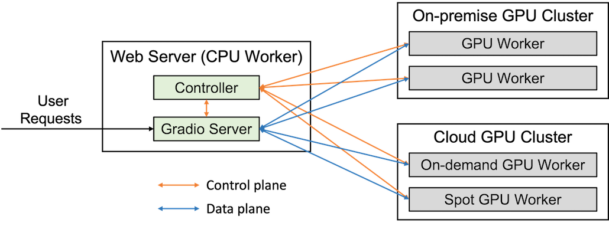

# 项目替换组件

- 1、整个项目中使用fastapi构建了内部的路由的127.0.0.1:7861/{路径} 来构建的api，进行对话的核心功能的调用
fastapi使用的协程，能够支撑大并发量
- 2、项目中使用streamlit构建的外部的 0.0.0.0:8501 构建的对外web界面的访问链接。
实际调用时都是通过内部路由再走进 127.0.0.1:7861去实际调用。 streamlit渲染量太大不适合并发，只能做demo，需要替换。
- 3、项目中：bge-large-zh embedding向量化使用了模型、reranker的重排使用了模型、最后生成对话chatglm也使用了llm。 这三个都是使用gpu的，特别是最后llm是耗时最大的部分，都适合使用在线的商业公司api，以提高项目的并发。
否则只能使用gpu串行，成本高且扩展难度大。
- 4、项目使用fastchat作为框架来调用语言对话模型和将其作为服务。fastchat网络资料得知其能支持一定的并发量，因此可以不做替换。
FastChat 框架部署一个完整的模型服务主要分为三个部分，分别为： Controller ， Server 以及多个 Worker

- 5、从[kb_config.py.example](configs%2Fkb_config.py.example)文件可知，存储一些普通信息数据库用的时sqlite，存储向量数据用的时faiss在本地创建向量数据库。
- 在线商业api
- 
| 模型类别      | 模型                 |     公司      |链接 |
|-----------|:-------------------|:-----------:|-------:|
| embedding | bge-large-zh       |     抖音      |   https://www.volcengine.com/docs/84313/1254626 |
| reranke   | bge-reranker-large |             |   |
| llm       | doubao或chatglm     | 抖音豆包/智普开放平台 | https://www.volcengine.com/docs/82379/1263594 |

- faiss向量数据库和引擎 的性能在10w个786维的量级下，搜索基本在1～2毫秒左右，特别适合自然语言这种稠密向量的搜索和存储。上述量级的向量大概占用1～2G内存。当数据量级很大时，可以考虑
专门的faiss服务器后端提供统一服务。
- 通过源文件向量库不要使用 init_database.py这个，还是要使用界面里面的按钮，目前发现直接使用init_database.py 建立的向量库完全没法用。